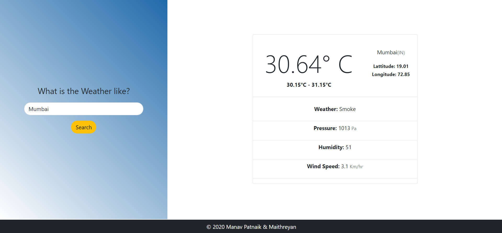

# Weather Dashboard

Link: [Weather Dashboard](https://serene-bastion-14573.herokuapp.com/)

#### A simple weather dashboard built with Django

#### Search for your city

To run on your local machine:

Clone this repo:
`git clone https://github.com/manavpatnaik/django-weather-dashboard.git`

Install the requirements:
`pip install -r requirements.txt`

Run the development server:
`python manage.py runserver`